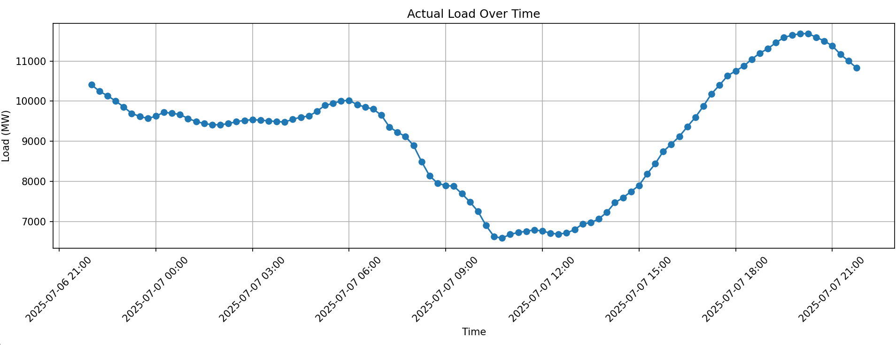

# Extensible ENTSOE ETL

The ENTSOE API returns raw XML, making it difficult to use the returned data Python-usable and 

This repository defines extract, transform and load (ETL) operations for the ENTSOE API.

## Examples

Code:

```
job = NetherlandsActualLoad(
    extractor=LoadForecastExtractor(),
    transformer=LoadTransformer(),
    loader=VisualizeLoader()
)

job.run(
    bidding_zone="10YNL----------L",
    load_type=LoadType.FORECAST,
    target_date="2025-07-07",
    n_days=1
)
```

Result:

In the above code snippet, custom-defined extract, transform and load operations can be combined to build and run a pipeline.

In this case, the _load_ operation routes the retrieved and transformed data to a visualizer that uses Matplotlib. However, this could also be a CSV fie, an SQL DB, a time-series database like TimeScaleDB or InfluxDB, etc.

The result of the previous ETL:




# Usage

An ENTSOE API key needs to be featured in your .env for the repository to function:

API_KEY=<entsoe_api_key>

## Data structure

## Extractors
## Transformers
## Loaders
## Jobs

